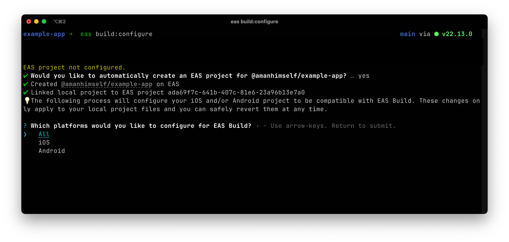
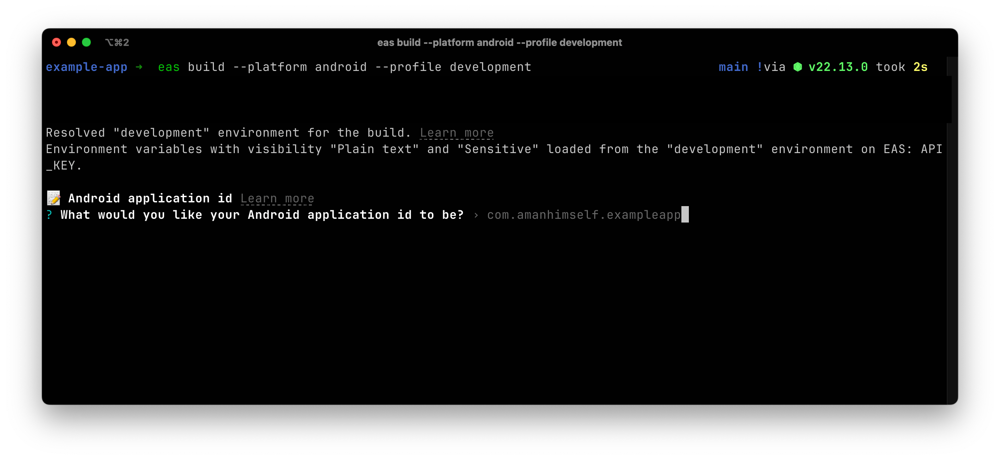

* goal
  * configure your project -- via -- `eas build:configure`

* steps
  * | project's path
    * `eas build:configure`
      * prompt 
        * if you want to create EAS project
        * platforms to configure

          
        * if it's an Expo Project & NOT configured your "app.json" with `android.package` &/OR `ios.bundleIdentifier` -> EAS CLI will prompt you -- to -- specify them
          * [`android.package`](../../public/static/schemas/unversioned/app-config-schema.json)
          * [`ios.bundleIdentifier`](../../public/static/schemas/unversioned/app-config-schema.json)

          
        * if you set `cli.requireCommit: true` | your **eas.json** -> EAS CLI will prompt you -- to -- commit ALL changes

      * AUTOMATICALLY create "eas.json" / [default configuration](../eas/json.md)
