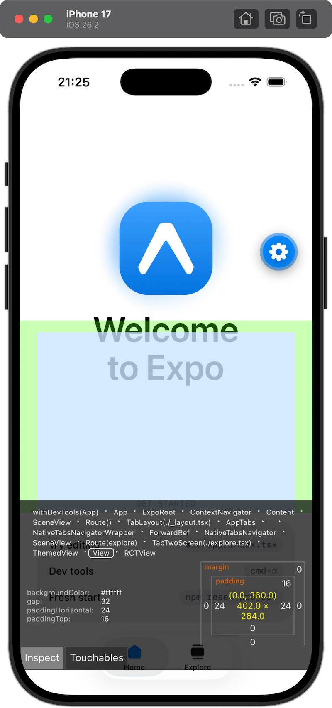
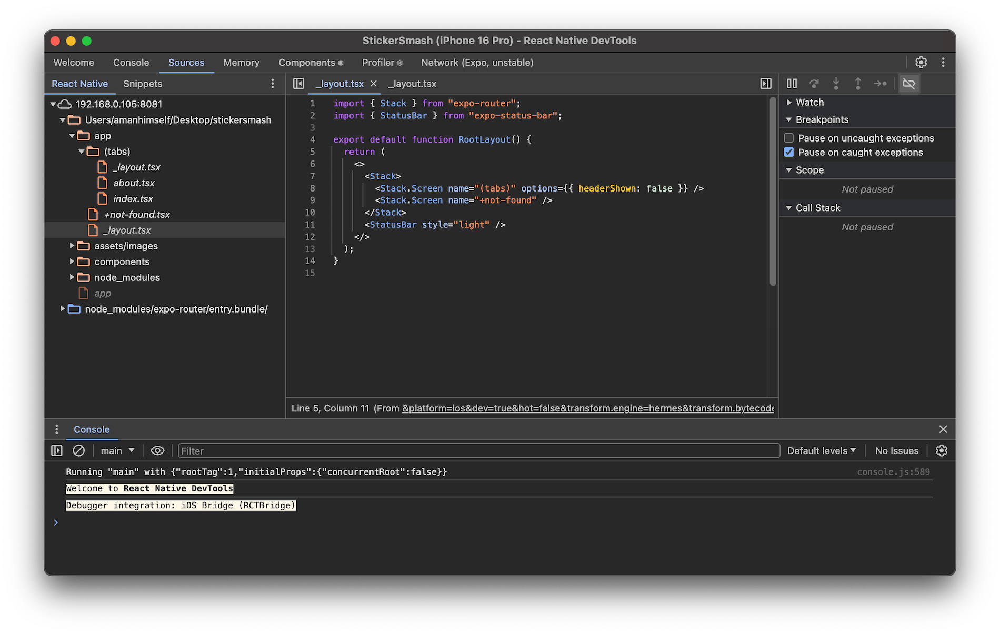
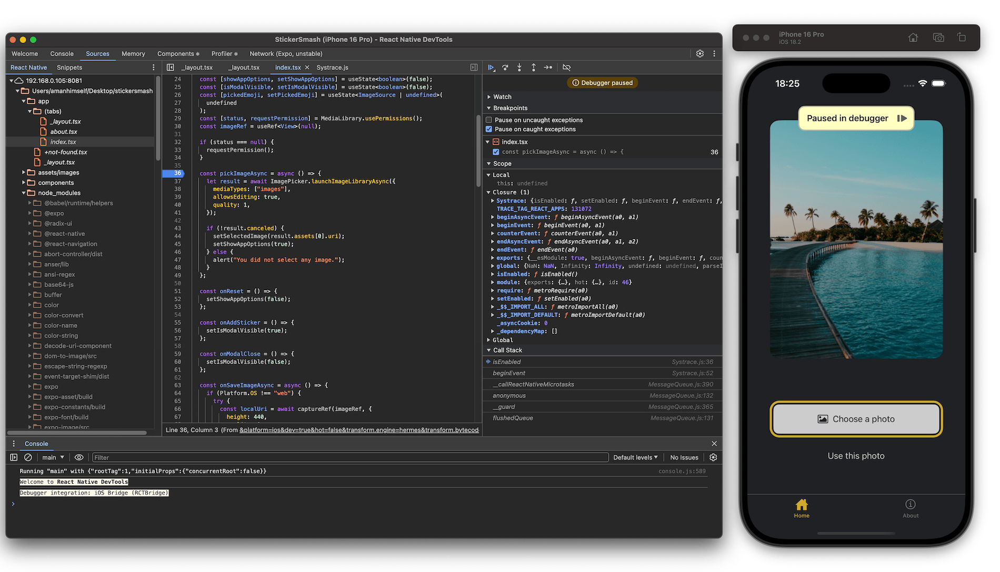
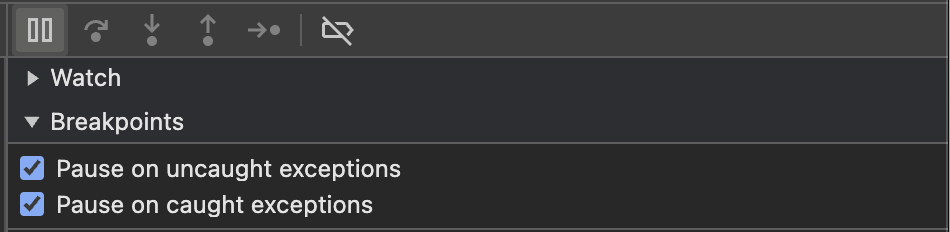
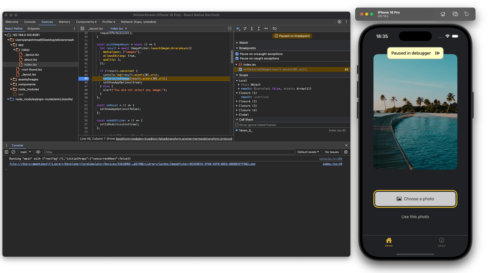
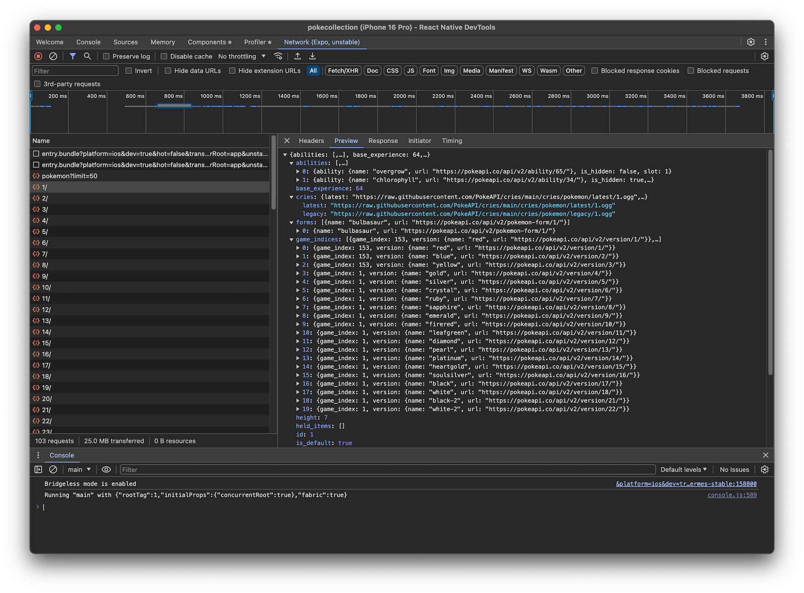
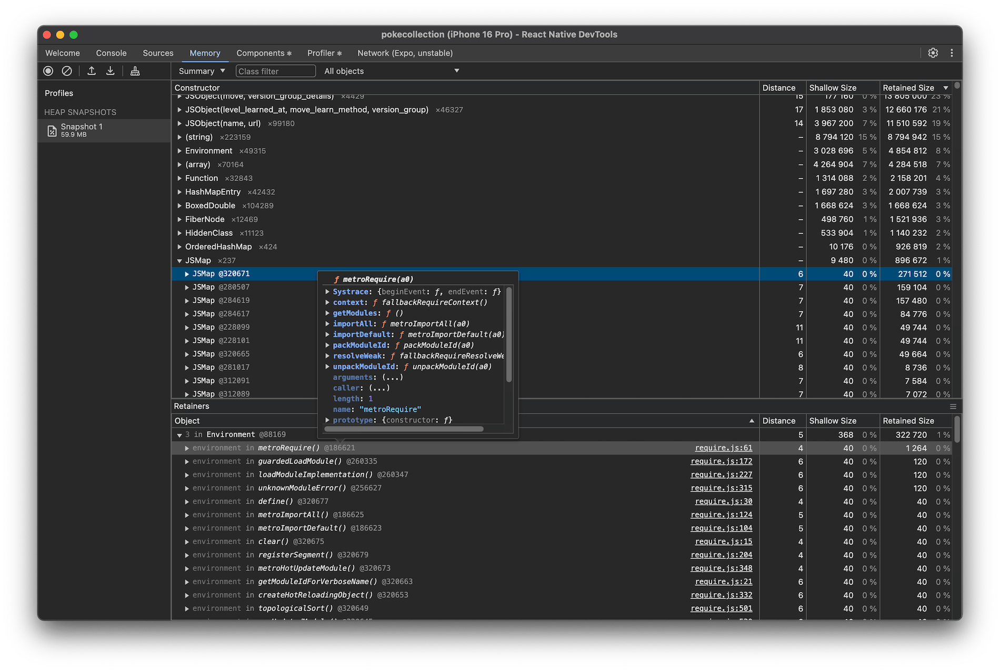
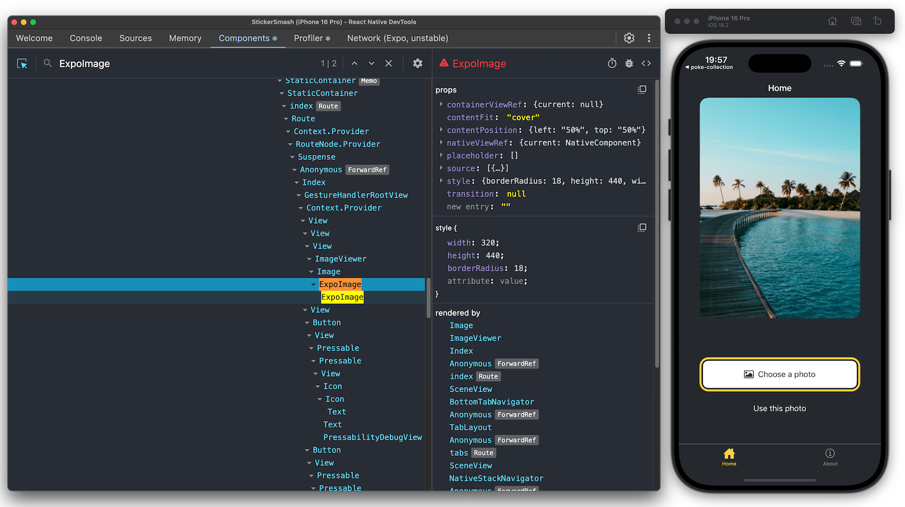
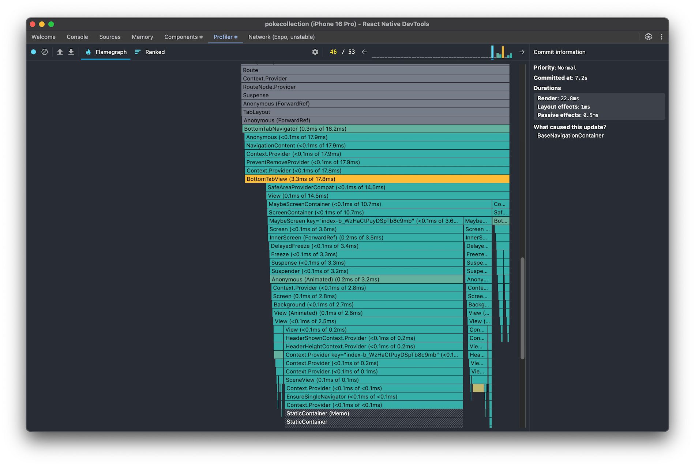
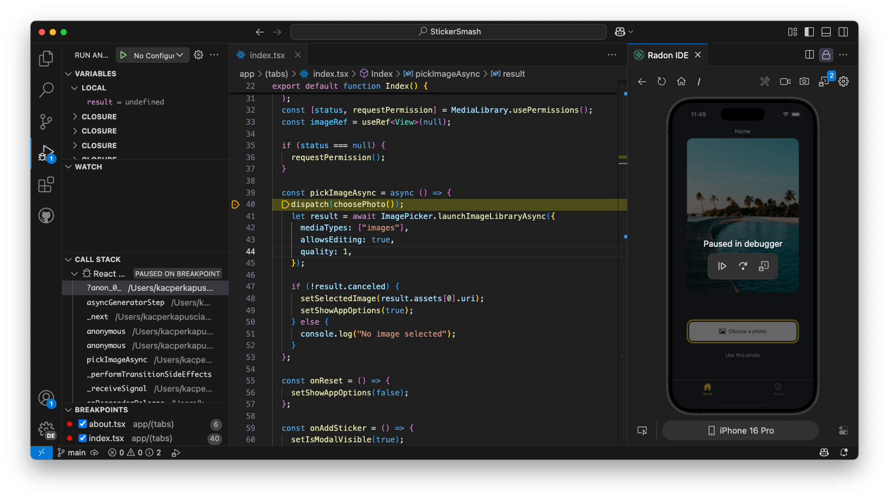

* goal
  * tools / inspect your Expo project | runtime 

* React Native == JS + native code 
  * ⚠️-> if an error is thrown -- from the -- JS code -> you MIGHT NOT find it -- via -- debugging tools | native code ⚠️
    * TODO: check React Native architecture

## Developer menu

* [source code](../../../packages/expo-dev-menu)
* provides
  * 👀-- access to -- useful debugging functions 👀
    * **Copy link**
      * ⚠️ALLOWED ONLY | dev clients⚠️
      * link -- to the -- [dev server address | dev client](../more/expo-cli.md#server-url)
    * **Reload**
      * reload you app
        * NORMALLY, NOT necessary
          * Reason: 🧠 Fast Refresh is enabled by default 🧠
    * **Go Home**
      * leave your app & navigate back to the dev client's or Expo Go app's Home screen
    * **Toggle performance monitor**
      * view the performance information about your app
    * **Toggle element inspector**
      * enable or disable the element inspector overlay
    * [**Open DevTools**](#debugging-with-react-native-devtools)
    * **Fast Refresh**
      * | make changes | your project's files, 
        * toggle automatic refreshing of the JS bundle 
* built into
  * dev clients
  * Expo Go
* steps to open it
  * press `m`

* ALTERNATIVES
  * Android device WITHOUT USB
    * Shake the device vertically
  * Android Emulator or device WITH USB
    * Press <kbd>Cmd ⌘</kbd> + <kbd>m</kbd> or <kbd>Ctrl</kbd> + <kbd>m</kbd>
    * run `adb shell input keyevent 82`
  * iOS device WITHOUT USB
    * Shake the device
    * Touch three fingers to the screen
  * iOS Simulator or device WITH USB
    * Press <kbd>Ctrl</kbd> + <kbd>Cmd ⌘</kbd> + <kbd>z</kbd> or <kbd>Cmd ⌘</kbd> + <kbd>d</kbd>

### Toggle performance monitor

* provide
  * your app's performance information
    - RAM usage of a project.
    - JavaScript heap (this is an easy way to know of any memory leaks in your application).
    - 2 Views
      - | top,
        - \# views for the screen 
      - | bottom,
        - \# of views | component
    - Frames / Second -- for the -- UI & JS threads
      - UI thread
        - uses
          - native Android or iOS UI rendering
      - JS thread
        - where MOST of your logic runs
          - _Examples:_ API calls + touch events

### Toggle element inspector

* provide
  * capabilities to
    - Inspect: Inspect elements
    - Perf: Show Performance overlay
    - Network: Show network details
    - Touchables: Highlight touchable elements

## Debugging with React Native DevTools

* React Native DevTools
  * ⚠️requirements⚠️
    * React Native v0.76+
    * [Hermes](../guides/using-hermes) -- as -- JS engine
  * == debugging tool -- for -- Expo apps & React Native apps /
    * modern
    * allows you to,
      * gain insights about your app's JS code -- by -- accessing the tabs
        * [Console](#interacting-with-the-console)
        * [Sources](#pausing-on-breakpoints)
        * [Network](#inspecting-network-requests-expo-only)
          * AVAILABLE ONLY | Expo
        * [Memory](#inspecting-memory)
    * built-in support -- for -- React DevTools
      * [Components](#inspecting-components) 
      * [Profiler](#profiling-javascript-performance)
  * ALLOWED | 
    * dev clients, OR
    * Expo Go
    * ANY app -- , by using, -- [Hermes](../guides/using-hermes) 
  * replacement of Chrome DevTools 
  * steps to open it
    * | terminal / run the Expo app,
      * press `J`

### Pausing on breakpoints

* steps
  * ways
    * | React Native DevTools,
      * \> Sources tab > set the breakpoint | some line number, OR
    * | your code,
      * add `debugger` statement

### Pausing on exceptions

* enable you to
  * pause your app | ANY thrown error
* SOME errors
  * might be caught -- by -- OTHER components | your app
    * _Example:_ Expo Router
* steps
  * | React Native DevTools,
    * \> Sources > turn on "Pause on caught exceptions"

### Interacting with the console

The **Console** tab gives you access to an interactive terminal, connected directly to your app
* You can write any JavaScript inside this terminal to execute snippets of code as if it were part of your app
* The code is executed in the global scope by default
* But, when using breakpoints from the [Sources](#pausing-on-breakpoints) tab, it executes in the scope of the reached breakpoint
* This allows you to invoke methods and access variables throughout your app.

### Inspecting network requests (Expo only)

> **info** The Network tab in React Native DevTools is only available when you have `expo` installed in your project.

The **Network** tab gives you insights into the network requests made by your app
* You can inspect each request and response by clicking on them
* This includes `fetch` requests, external loaded media, and in some cases, even requests made by native modules.

> **info** See the [Inspecting network traffic](#inspecting-network-traffic) for alternative ways to inspect network requests.

### Inspecting memory

The **Memory** tab allows you to inspect the memory usage and take a heap snapshot of your app's JavaScript code.

### Inspecting components

The **Components** tab allows you to inspect the React components in your app
* You can view the props, and styles of each component by hovering that component in React Native DevTools
* This is a great way to debug your app's UI and understand how your components are structured.

### Profiling JavaScript performance

> **warning** Profiles are not yet symbolicated with sourcemaps, and [can only be used in debug builds](https://github.com/facebook/hermes/issues/760)
* These limitations will be addressed in upcoming releases.

The **Profiler** tab allows you to record and analyze the performance of your app's JavaScript
* You can start recording, interact with your app, and stop recording to analyze the profile.

> **info** To profile the native runtime, use the tools included in Android Studio or Xcode.

### Rozenite

[**Rozenite**](https://www.rozenite.dev/) is a React Native DevTools plugin framework
* It allows you to install plug-and-play integrations which get auto-discovered and appear as panels in React Native Devtools
* You can also [create your own Rozenite plugin](https://www.rozenite.dev/docs/plugin-development/plugin-development) to integrate with custom or third party tools.

## Debugging with VS Code

> **warning** VS Code debugger integration is in [alpha](/more/release-statuses/#alpha)
* For the most stable debugging experience, [use the React Native DevTools](#debugging-with-react-native-devtools).

VS Code is a popular code editor, which has a built-in debugger
* This debugger uses the same system as the React Native DevTools — the inspector protocol.

You can use this debugger with the [Expo Tools](https://github.com/expo/vscode-expo#readme) VS Code extension
* This debugger allows you to set breakpoints, inspect variables, and execute code through the debug console.

To start debugging:

- Connect your app
- Open VS Code command palette (based on your computer, it's either <kbd>Ctrl</kbd> + <kbd>Shift</kbd> + <kbd>P</kbd> or <kbd>Cmd ⌘</kbd> + <kbd>Shift</kbd> + <kbd>P</kbd>)
- Run the **Expo: Debug ...** VS Code command.

This will attach VS Code to your running app.

Alternatively, if you want a fully-featured IDE setup in VS Code, you might want to check out the [Radon IDE](https://ide.swmansion.com/) extension (paid with a 30-day free trial)
* It turns your editor into a powerful environment designed specifically for React Native and Expo projects, with advanced debugging, a network inspector, router integration, and other built-in tools.

## React Native Debugger

> **warning** The React Native Debugger requires Remote JS debugging, which has been deprecated since [React Native 0.73](https://reactnative.dev/docs/other-debugging-methods#remote-javascript-debugging-deprecated).

The React Native Debugger is a standalone app that wraps the React DevTools, Redux DevTools, and React Native DevTools
* Unfortunately, it requires the [deprecated Remote JS debugging workflow](https://github.com/jhen0409/react-native-debugger/discussions/774) and is incompatible with Hermes.

If you are using Expo **SDK 50** or **above**, you can use the [Expo dev tools plugins](/debugging/devtools-plugins) equivalents to the React Native Debugger:

- [React Native DevTools](#debugging-with-react-native-devtools)
- [Redux DevTools](/debugging/devtools-plugins/#redux)

If you are using Expo SDK 49 and earlier, you can use the React Native Debugger
* This section provides quick get started instructions
* For in-depth information, check its [documentation](https://github.com/jhen0409/react-native-debugger#documentation).

You can install it via the [release page](https://github.com/jhen0409/react-native-debugger/releases), or if you're on macOS you can run:

<Terminal cmd={['$ brew install react-native-debugger']} />

### Startup

After firing up React Native Debugger, you'll need to specify the port (shortcuts: <kbd>Cmd ⌘</kbd> + <kbd>T</kbd> on macOS, <kbd>Ctrl</kbd> + <kbd>T</kbd> on Linux/Windows) to `8081`. After that, run your project with `npx expo start`, and select `Debug remote JS` from the Developer Menu. The debugger should automatically connect.

In the debugger console, you can see the Element tree, as well as the props, state, and children of whatever element you select. You also have the Chrome console on the right, and if you type `$r` in the console, you will see the breakdown of your selected element.

If you right-click anywhere in the React Native Debugger, you'll get some handy shortcuts to reload your JS, enable/disable the element inspector, network inspector, and to log and clear your `AsyncStorage` content.

[react-native-debugger demo](../../public/static/videos/debugging/react-native-debugger.mp4)

### Inspecting network traffic

It's easy to use the React Native Debugger to debug your network request: right-click anywhere in the React Native Debugger and select `Enable Network Inspect`. This will enable the Network tab and allow you to inspect requests of `fetch` and `XMLHttpRequest`.

There are however [some limitations](https://github.com/jhen0409/react-native-debugger/blob/master/docs/network-inspect-of-chrome-devtools.md#limitations), so there are a few other alternatives, all of which require using a proxy:

- [Charles Proxy](https://www.charlesproxy.com/documentation/configuration/browser-and-system-configuration/) (~$50 USD, our preferred tool)
- [Proxyman](https://proxyman.io) (Free version available or $49 to $59 USD)
- [mitmproxy](https://medium.com/@rotxed/how-to-debug-http-s-traffic-on-android-7fbe5d2a34#.hnhanhyoz)
- [Fiddler](https://www.telerik.com/fiddler)

## Debugging production apps

* crash and bug reporting system
  * if you implement it -> it can help you -- get -- real-time insights of your production apps 
* see [error reporting services](../debugging/runtime-issues.mdx/#using-error-reporting-services)
