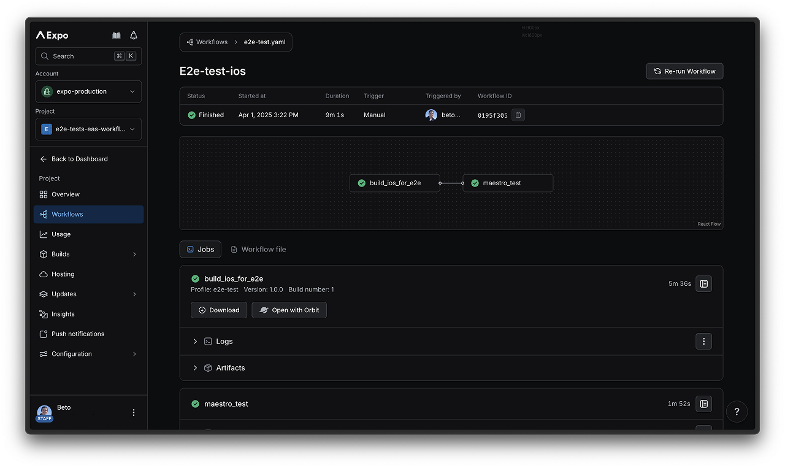

* goal
  * how to run E2E tests | EAS Workflows -- via -- [Maestro](https://maestro.dev/)

## Set up your project

* steps
  * [create a NEW project + sync it -- with -- EAS](../get-started) 
  * [configure your project + link -- to -- your Github repository](../get-started.md#configure-your-project)

## Add example Maestro test cases

* Expo app default template


* goal
  * create 2 simple Maestro flows

* steps
  * `mkdir .maestro`
  * `touch .maestro/home.yml`

      ```yaml .maestro/home.yml
      # flow / 
      #   launch the app
      #   assert "Welcome!" is VISIBLE | home screen   
      appId: dev.expo.eastestsexample # customize name
      ---
      - launchApp
      - assertVisible: 'Welcome!'
      ```
  * `touch .maestro/expand_test.yml`

      ```yaml .maestro/expand_test.yml
      # flow / 
      #   open the "Explore" screen | example app
      #   click | "File-based routing" collapsible
      #   assert "This app has two screens." is VISIBLE | screen
      appId: dev.expo.eastestsexample # customize name
      ---
      - launchApp
      - tapOn: 'Explore.*'
      - tapOn: '.*File-based routing'
      - assertVisible: 'This app has two screens.*'
      ```

## how to run Maestro tests locally -- OPTIONAL --

* Reason of being OPTIONAL: 🧠run the workflow DIRECTLY | EAS🧠

* steps
  * [install the Maestro CLI](https://docs.maestro.dev/maestro-cli/how-to-install-maestro-cli)
  * [install your app | local Android Emulator OR iOS Simulator](../../../more/expo-cli.md#compiling)
  * run maestro commands

    ```
    maestro test .maestro/expand_test.yml
    maestro test .maestro/home.yml
    ```

* [video](../../../../public/static/videos/guides/local-e2e.mp4)

## Build profile for E2E tests

* E2E tests
  * requirements
    * built app file
      * Reason:🧠EAS can
        * install it
        * test it | emulator/simulator🧠
      * _Example:_ 
        * | Android, 
          * ".apk
        * | iOS,
          * ".app"

* steps
  * | "eas.json", 
    * create a dedicated E2E build profile

      ```json eas.json
      {
        "build": {
          "e2e-test": {
            "withoutCredentials": true,
            "ios": {
              "simulator": true
            },
            "android": {
              "buildType": "apk"
            }
          }
        }
      }
      ```

## Create an E2E test workflow

* steps
  * `mdir .eas/workflows`
  * | Android,
    * `touch .eas/workflows/e2e-test-android.yml`

      ```yaml .eas/workflows/e2e-test-android.yml
      name: e2e-test-android
    
      on:
        pull_request:
          branches: ['*'] # Run the E2E test workflow on every pull request.
      jobs:
        build_android_for_e2e:
          type: build
          params:
            platform: android
            profile: e2e-test # your eas build profile for E2E test
    
        maestro_test:
          needs: [build_android_for_e2e]
          type: maestro
          params:
            build_id: ${{ needs.build_android_for_e2e.outputs.build_id }}
            flow_path: ['.maestro/home.yml', '.maestro/expand_test.yml']
      ```
  * for iOS
    * `touch .eas/workflows/e2e-test-ios.yml`

        ```yaml .eas/workflows/e2e-test-ios.yml
        name: e2e-test-ios
        
        on:
          pull_request:
            branches: ['*']
        
        jobs:
          build_ios_for_e2e:
            type: build
            params:
              platform: ios
              profile: e2e-test # your eas build profile for E2E test
        
          maestro_test:
            needs: [build_ios_for_e2e]
            type: maestro
            params:
              build_id: ${{ needs.build_ios_for_e2e.outputs.build_id }}
              flow_path: ['.maestro/home.yml', '.maestro/expand_test.yml']
        ```

## Run the E2E test workflow

* ways to run E2E test workflow
  * MANUALLY -- via -- EAS CLI

    ```
    npx eas-cli@latest workflow:run .eas/workflows/e2e-test-android.yml
    ```
  * AUTOMATICALLY | open a PR

* if you want to track its progress -> check | EAS dashboard

  

## More

* [Maestro insights](../../../eas-insights/maestro.md)
