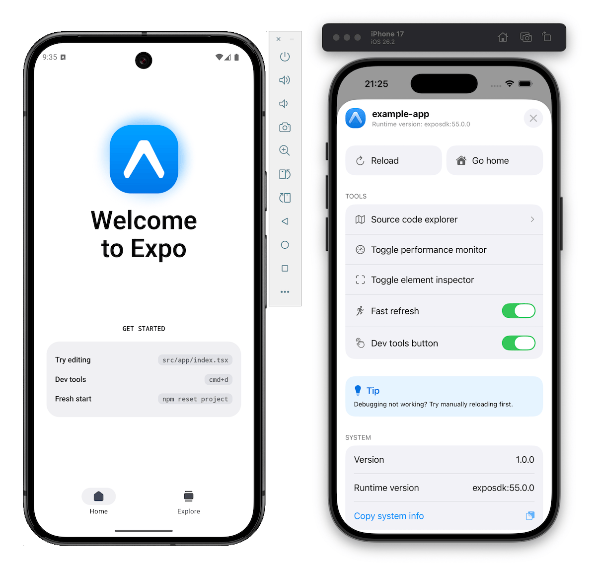
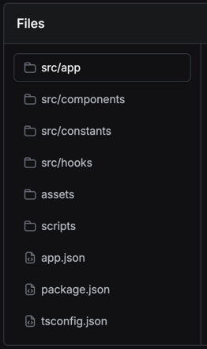

* goal
  * change the Expo project & see it live | your device

## Start a development server

* `npx expo start` OR `yarn expo start` OR `pnpm expo start` OR `bun expo start`
  * start the development server
  * display QR code | your terminal 

## Open the app | your device

* scan QR code -- to -- open the app | your device
  * if you have problems -> 
    * check your computer's Wi-Fi network == your device's WI-FI network OR
    * `npx expo start --tunnel` OR `yarn expo start --tunnel` OR `pnpm expo start --tunnel` OR `bun expo start --tunnel`
      * == **Tunnel** connection type | start the development server
      * -> app reloads speed << app reloads | **LAN** or **Local**, speed

* if you want to use an emulator
  * -> press
    * `a` -- to open the -- app | Android Emulator 
    * `i` -- to open the -- app | iOS Simulator
  * use cases
    * **Tunnel** connection type

## Make your first change

* | "src/app/index.tsx"

  ```text
  <DiffBlock
    raw={`diff --git a/src/app/index.tsx b/src/app/index.tsx
  index 45cfa0e..4d1b384 100644
  --- a/src/app/index.tsx
  +++ b/src/app/index.tsx
  @@ -17,7 +17,7 @@ export default function HomeScreen() {
          <ThemedView style={styles.heroSection}>
            <AnimatedIcon />
            <ThemedText type="title" style={styles.title}>
  -           Welcome to&nbsp;Expo
  +           Hello World!
            </ThemedText>
          </ThemedView>
    `}
  />
  ```

### Problem: changes NOT shown up | your device

* Expo Go
  * 's default behavior
    * | change a file, AUTOMATICALLY reload the app 

* ATTEMPTS to fix it
  * check [development mode is enabled | Expo CLI](../workflow/development-mode#development-mode)
  * TODO: Close the Expo app and reopen it.
  * Once the app is open again, shake your device to reveal the developer menu
    * Press <kbd>Cmd ⌘</kbd> + <kbd>D</kbd>.
  * If you see **Fast Refresh** enabled, toggle it
    * If you see **Disable Fast Refresh**, dismiss the developer menu

      

## File structure

* [default project's file structure](../../scenes/get-started/start-developing/ProjectStructure/index.md)

  

## Features

* [default project template's features](../../scenes/get-started/start-developing/TemplateFeatures/index.md)
