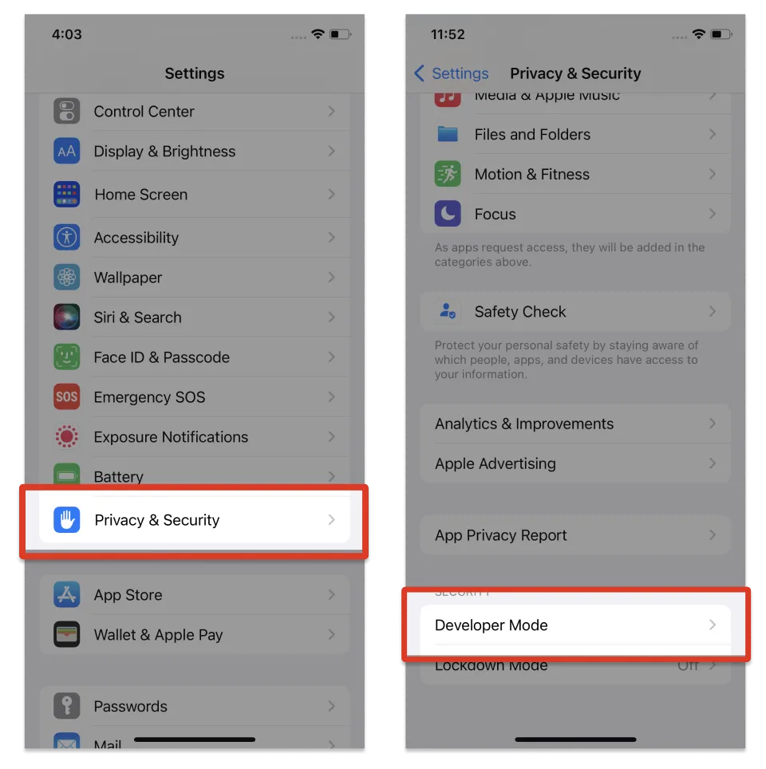
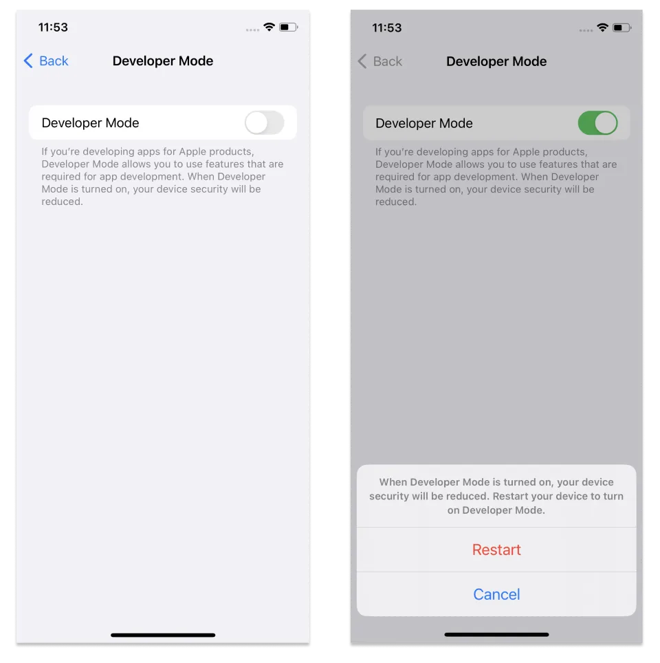
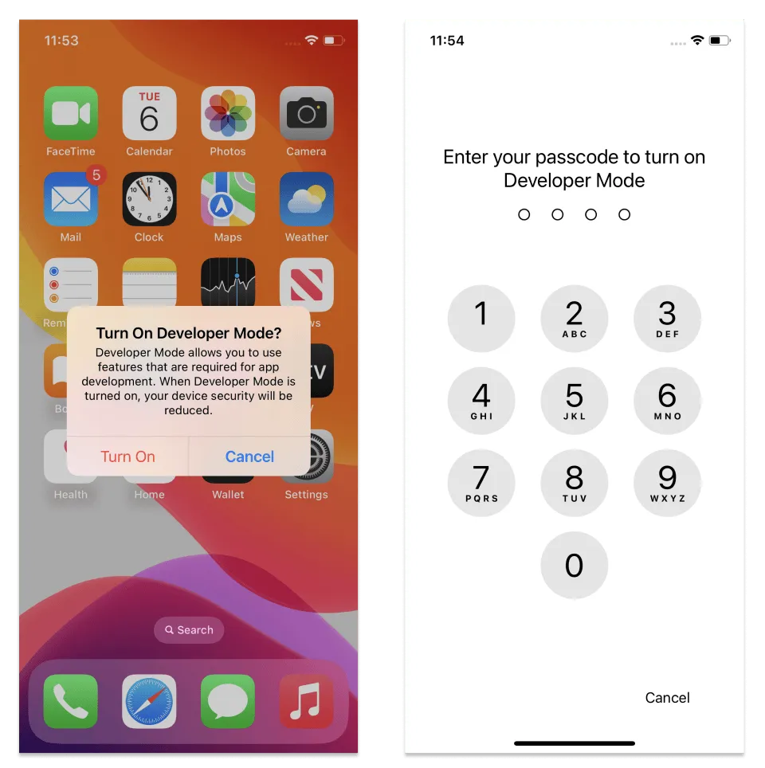
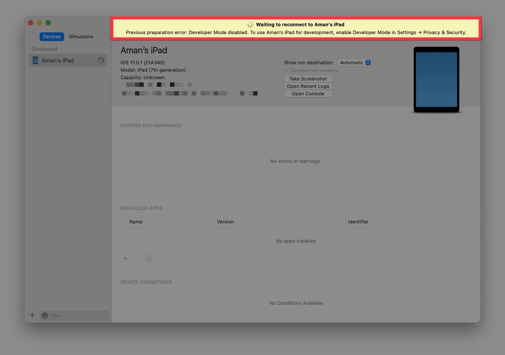
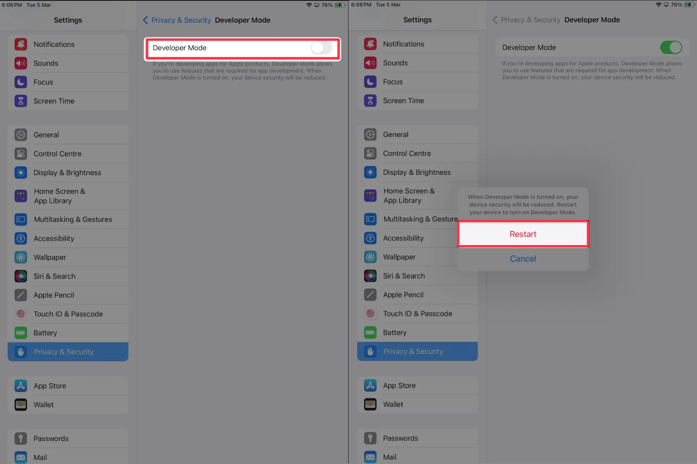

* iOS Developer Mode
  * | iOS v16+,
    * ⚠️MANDATORY to enable to run ⚠️
      * [internal distribution builds](../build/internal-distribution) OR
        * EXCEPT TO
          * builds / 
            * signed -- via -- enterprise provisioning
            * installed | iOS Simulator  
      * local development builds

* ways
  * | [your iOS DIRECTLY](#directly--ios-device)
  * | [your iPhone / connected to your Mac](#connect-an-ios-device----with----a-mac)

## Enable Developer Mode

### DIRECTLY | iOS device

1. Settings > Privacy & Security > Developer Mode
  * Tap the switch / enable **Developer Mode**
2. restart the device
  * Tap **Turn On**

To follow the steps below, **install your development build on your device before enabling the Developer Mode.**
When the build is created, follow the instructions on the EAS dashboard to install it on your iOS device.

<Step label="1">

Once the build is installed on your device, press the app icon
* This will open an alert asking you to enable Developer Mode
* Press **OK**.

</Step>

<Step label="2">

Go to the Settings app, and navigate to **Privacy & Security** > **Developer Mode**.

</Step>

<Step label="3">

Enable the toggle
* You will receive a prompt from iOS to restart your device
* Press **Restart**.

</Step>

<Step label="4">

After the device restarts, unlock your device
* A system alert should appear
* Press **Turn On** and then, when prompted, enter your device's passcode.

</Step>

Developer Mode is now enabled
* You can now interact with your internal distribution builds and local development builds.

You can turn off Developer Mode at any time
* However, you'll need to repeat this same process to re-enable it.

### Connect an iOS device -- with -- a Mac

> **Note:** Xcode must be installed on the Mac device before following the steps below.

You don't need to install the development build on your iOS device first to enable Developer Mode by connecting it to a Mac
* You can:

<Step label="1">

Connect your iOS device to a Mac using a USB cable
* Press **Trust** on your iOS device when **Trust This Computer?** alert is prompted.

</Step>

<Step label="2">

Open Xcode, and from the menu bar, navigate to **Window** > **Devices and Simulators**.

Under **Devices**, you'll see a warning "Previous preparation error: Developer Mode disabled" with instructions on enabling Developer Mode on the iOS device.

</Step>

<Step label="3">

On the iOS device, open **Settings** > **Privacy & Security** > **Developer Mode**.

Enable the toggle
* You will receive a prompt from iOS to restart your device
* Press **Restart**.

</Step>

<Step label="4">

After the device restarts, unlock your device
* A system alert should appear
* Press **Turn On**, and enter your device's passcode when prompted.

</Step>

Developer Mode is now enabled
* You can now interact with your internal distribution builds and local development builds.

You can turn off Developer Mode at any time
* However, you'll need to repeat this same process to re-enable it.
