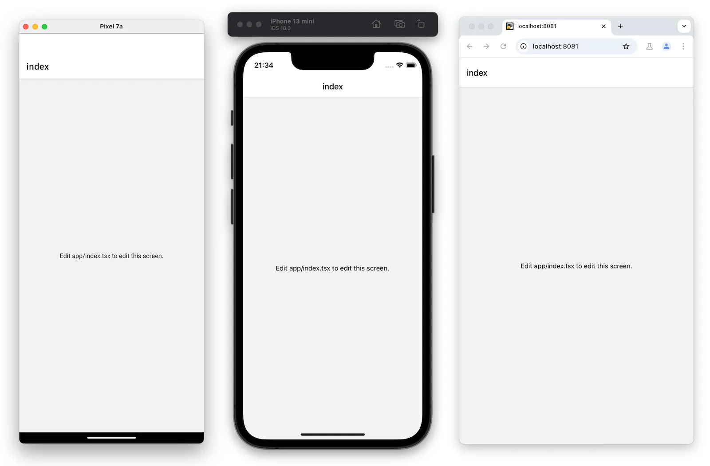
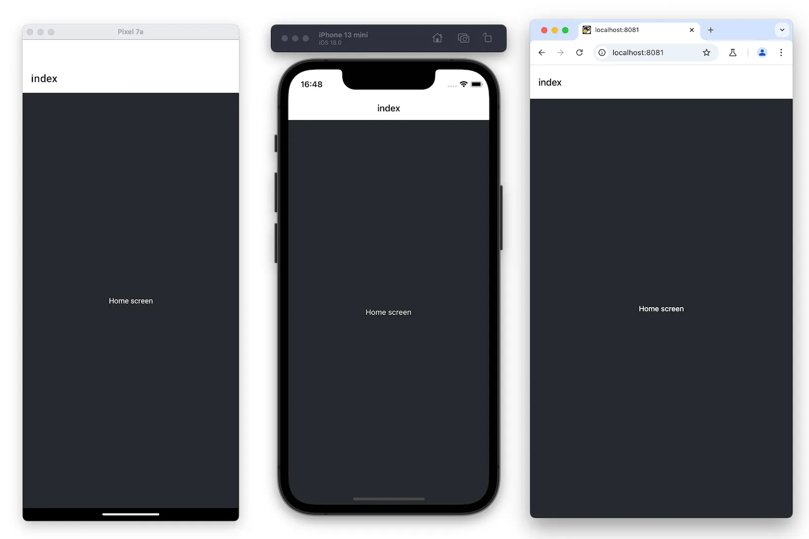

* goal
  * create an app -- via -- default template with TypeScript enabled

* [video](https://www.youtube.com/watch?v=m1-bc53EGh8)
  * TODO:

* prerequisites
  * [install Expo Go](../../scenes/get-started/set-up-your-environment/DevelopmentEnvironmentInstructions.md)
  * install [Node.js LTS ](https://nodejs.org/en)

* steps
  * [`create-expo-app`](../more/create-expo)
  * [reset project](../get-started/next-steps.md)

    

  * | "app/index.tsx",

  ```tsx app/index.tsx|collapseHeight=340
  export default function Index() {
    return (
      <View style={styles.container}>
        /* @tutinfo This used to say "Edit app/index.tsx to edit this screen". Now it says, "Home screen". */
        <Text style={styles.text}>Home screen</Text>
        /* @end */
      </View>
    );
  }
  
  const styles = StyleSheet.create({
    container: {
      flex: 1,
      /* @tutinfo Add the value of `backgroundColor` property with `'#25292e'`.*/
      backgroundColor: '#25292e',
      /* @end */
      alignItems: 'center',
      justifyContent: 'center',
    },
    text: {
      color: '#fff',
    },
  });
  ```

    
