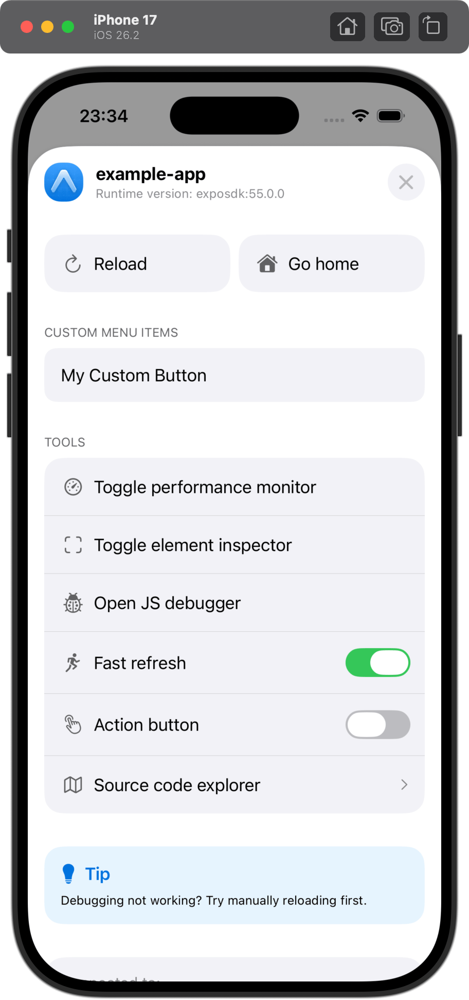

* "expo-dev-menu"
  * AVAILABLE | your debug builds
  * uses
    * as a standalone library | any Expo project
  * use cases
    * | [brownfield apps](brownfield) / ❌NOT need the full [`expo-dev-client`](dev-client) launcher interface❌
  * provides
    * developer menu UI -- for -- React Native apps /
      * has
        * menu UI /
          * accessible -- via -- shake gesture OR three-finger long press
          * powerful 
          * extensible 
        * quick access -- to -- common development actions
        * support -- for -- custom menu items / extend functionality

## Installation

```bash
npx expo install expo-dev-menu
---
yarn expo install expo-dev-menu
---
pnpm expo install expo-dev-menu
---
bun expo install expo-dev-menu
```

## Usage

* ways to open it
  - **Shake gesture**: Shake your device
  - **Three-finger long press**: Long press with three fingers on the screen
  - **Programmatically**: Call `DevMenu.openMenu()` from your code

## Extending the dev menu

The dev menu can be extended to include extra buttons by using the `registerDevMenuItems` API:

```tsx

const devMenuItems = [
  {
    name: 'My Custom Button',
    callback: () => console.log('Hello world!'),
  },
];

registerDevMenuItems(devMenuItems);
```

This will create a new section in the dev menu that includes the buttons you have registered:



> **Note:** Subsequent calls of `registerDevMenuItems` will override all previous entries.

## if you are using development builds, how to use?

* install `expo-dev-client`
  * Reason:🧠it includes `expo-dev-menu`🧠

  ```bash
  $ npx expo install expo-dev-client
  ---
  $ yarn expo install expo-dev-client
  ---
  $ pnpm expo install expo-dev-client
  ---
  $ bun expo install expo-dev-client
  ```

## API

* steps to use it

  ```js
  import * as DevMenu from 'expo-dev-menu';
  ```
