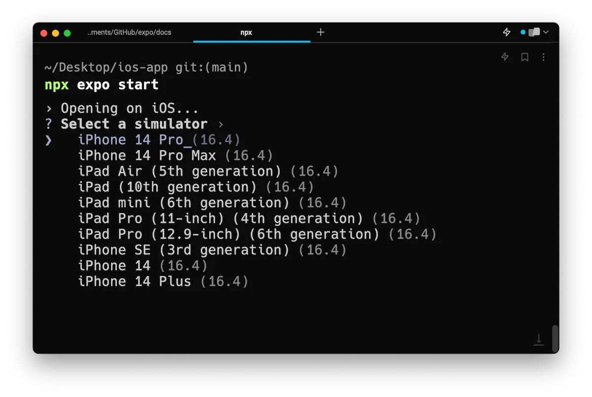
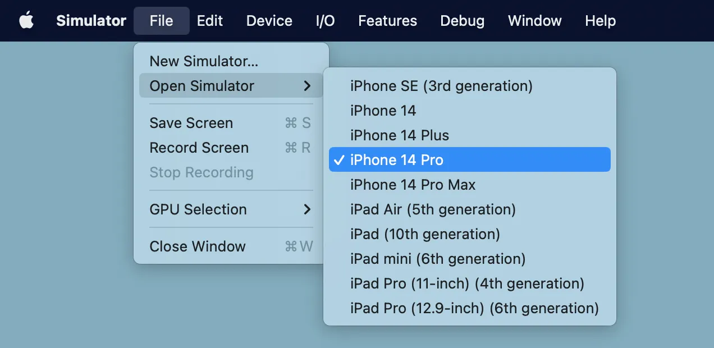

* recommendations
  * develop your app | computer
    * rather than constantly -- interacting with an -- iPhone or iPad
    * use cases
      * network conditions are slow
      * [tunnel connection](../more/expo-cli.md#tunneling) -- is required due to -- LAN limitations

* goal
  * how to install the iOS Simulator | your Mac 

* requirements
  * macOS

## Setup Xcode and Watchman

* [Xcode instructions](../../scenes/get-started/set-up-your-environment/instructions/_xcodeInstructions.md)

### Try it out

* | your Expo app
  * `npx expo start` &
    * press `i`
    * press `shift` + `i` / select a simulator to open
    
      

* if you get a warning -- about -- accept the Xcode license -> run the command again

  

## Expo Orbit

* [here](../build/orbit.md)

## iOS Simulator limitations

* hardware / unavailable | iOs Simulator
  * Audio Input
  * Barometer
  * Camera
  * Motion Support (accelerometer and gyroscope)
* suspends background apps & processes

* [Apple's documentation](https://help.apple.com/simulator/mac/current/#/devb0244142d)

## Troubleshooting

### | open a Simulator, CLI seems to be stuck 

* == iOS Simulator does NOT respond | open command
* SOLUTION
  * `open -a Simulator`
    * == open it MANUALLY
  * File> Open Simulator > select an iOS version + device

  

### Simulator opened, BUT the Expo Go app is NOT opened | Expo Go app

* SOLUTION:
  * | iOS simulator, 
    * surf to find Expo Go app

### How do I force an update -- to -- the latest version?

* create a project / use the desired SDK version

  ```bash
  # Bootstrap an SDK 51 project
  $ npx create-expo-app --template blank@51
  
  # Open the app on a simulator to install the required Expo Go app
  $ npx expo start --ios
  ```

### Expo CLI is printing an error message about `xcrun`

* ALTERNATIVES
  * TODO: Manually uninstall Expo Go on your simulator and reinstall by pressing <kbd>shift</kbd> + <kbd>i</kbd> in the Expo CLI Terminal UI and selecting the desired simulator.
  * If that doesn't help, focus the simulator window and in the Mac toolbar choose **Device** &gt; **Erase All Content and Settings...**<br/>
    * This will reinitialize your simulator from a blank image
  * This is sometimes useful for cases where your computer is low on memory and the simulator fails to store some internal files, leaving the device in a corrupt state.
